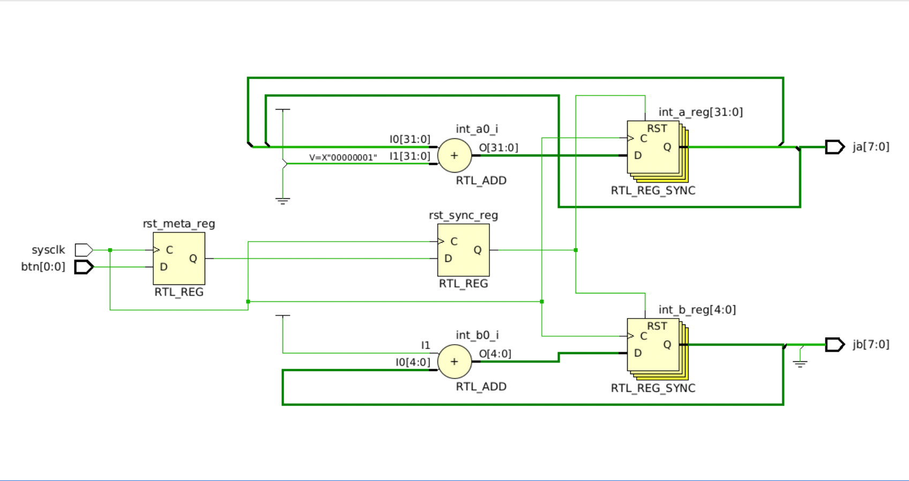
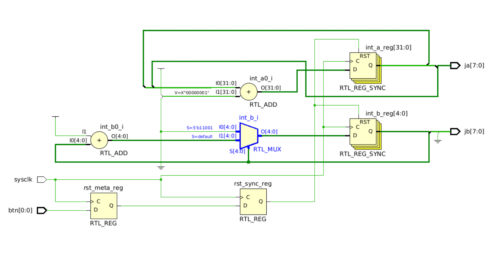

# Lab 3 — Counters and Integer Arithmetic (PYNQ-Z2)

## Goal

Study the behavior of counters and VHDL integer arithmetic in simulation and
synthesis, and verify counter outputs on real hardware using an oscilloscope.

## Hardware / Tools

- PYNQ-Z2 FPGA development board
- AMD/Xilinx Vivado (ML Edition)
- PicoScope 2205A (measurements)
- VHDL

## Design Overview

The design contains two synchronous counters mapped to 8-bit output buses:

- `int_a` — free-running counter, mapped to `ja[7:0]` (LSBs)
- `int_b` — range-limited counter, mapped to `jb[7:0]` (LSBs)

During the lab, `int_b` was modified multiple times to compare:
- **VHDL range limits** (simulation range checking)
- **synthesized hardware width** (flip-flop count)
- **explicit wrap logic** (reset to 0 at 25)

## Key Findings

### Simulation: max values and range checking

- With simulator range checks **OFF** (Vivado default):
  - `int_a` and `int_b` keep increasing without runtime errors
  - `ja` shows the 8 LSBs → max **255** then wraps
  - `jb` shows the 8 LSBs → max **255** then wraps

- With simulator range checks **ON**:
  - `int_a` still grows without limit
  - `int_b : integer range 0 to 31` triggers a runtime error at **32**:
    ```
    ERROR: runtime range check value 32 is out of valid range 0 to 31
    ```
  - `jb` max becomes **31** (because `int_b` is limited to 0…31)

### Registers: elaboration vs synthesis

- Elaborated design shows registers based on the declared signal types:
  - `int_a` → **32 FFs**
  - `int_b` (0…31) → **5 FFs**
- After synthesis, Vivado keeps only the bits that are actually required:
  - `int_a` reduced to **8 bits** because only `ja[7:0]` is used
  - `int_b` remains **5 bits** for 0…31
  - plus **2 FFs** for the reset synchronizer
- Total after synthesis: **15 registers** (= 8 + 5 + 2)

### Resource utilization (summary)

- Initial synthesis: **15 registers**, **4 LUTs**
- After adding explicit wrap-at-25 logic: **15 registers**, **5 LUTs**
- When widening `int_b` to 0…255 (still wrapping at 25):
  - Synthesis: **18 registers**, **8 LUTs**
  - Registers = 8 (`ja`) + 8 (`jb`) + 2 (reset synchronizer)

## Timing

From the constraints file, the clock is constrained as:

- 125 MHz: period **8 ns**, 50% duty cycle (`-waveform {0 4}`)

Timing summary results:

- At **125 MHz**: **WNS = +4.845 ns** (meets timing)
- At **250 MHz** (period **4 ns**, 50% duty): **WNS = +0.907 ns** (still meets timing)

## Oscilloscope Measurements

> Context: ×10 probes, DC coupling. PicoScope 2205A bandwidth is 25 MHz.
> High-frequency square waves may appear rounded due to bandwidth limits.

### `ja[0]` (LSB)

![ja[0]](figures/osc-ja-0.png)

Measured frequency: **62.5 MHz**

### `ja[1]` (bit 1)

![ja[1]](figures/osc-ja-1.png)

Measured frequency: **31.25 MHz**  
(As expected: `ja[0]` toggles at 2× the frequency of `ja[1]`.)

### `ja[7]` (MSB) → system clock frequency

![ja[7] duty cycle](figures/osc-ja-7-duty.png)

Measured `ja[7]` frequency: **488.4 kHz**, duty cycle **50.12%**

Since `ja[7] = f_sysclk / 256`, the system clock is:

- `f_sysclk ≈ 488.4 kHz × 256 ≈ 125 MHz`

### `jb[4]` (MSB for a 0…25 counter) → duty cycle analysis

![jb[4] duty cycle](figures/osc-jb-4-duty.png)

Measured frequency: **4.808 MHz**, duty cycle **38.8%**

With wrap at 25, `jb[4]` is LOW for 16 counts (0–15) and HIGH for 10 counts (16–25),
so duty cycle is approximately:

- `10 / (10 + 16) ≈ 38.5%` (matches measurement)

## Schematics

Elaborated design (includes reset synchronizer):



Elaborated design after adding wrap-at-25 logic (additional mux logic):



## Notes

- VHDL range limits affect simulation (with range checks enabled) but do not
  automatically constrain synthesized hardware behavior.
- To enforce a specific wrap value in hardware (e.g., 0…25), explicit compare
  and wrap logic is required.