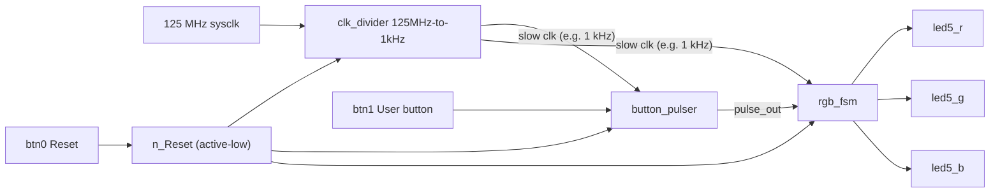

# Lab 4 – Button Pulser and RGB FSM (PYNQ-Z2)

## Goal

Design and simulate a simple digital system on the PYNQ-Z2 board using hierarchical design.  
Practice modular design, generics, test benches, and finite state machines.

## Signal Flow

- The `clk_divider` generates a slower clock from the main system clock.
- The `button_pulser` converts button presses into clean pulse signals.
- The `rgb_fsm` cycles through RGB LED states based on pulses.

## Architecture Block Diagram

## Components

- **Clock Divider** – produces a stable lower-frequency clock (~50 % duty cycle).
- **Button Pulser** – sends one pulse on short press; auto-repeats on long press.
- **RGB FSM** – changes LED color each time a pulse arrives.

## Simulation Summary

- **Clock Divider:** output toggles evenly after reset.
- **Button Pulser:**
  - Short press → one pulse.
  - Long press → pulses repeat until button release.
- **RGB FSM:**
  - After reset → RED active.
  - Each pulse → color advances RED → GREEN → BLUE → RED.
- **Top Level:** integrates all modules correctly and timing matches design.

## Notes

- 1 kHz clock prevents button bounce and ensures stable operation.
- Verified on **PYNQ-Z2** board:
  - `btn0` resets the system.
  - `btn1` changes LED color.
  - Short press = single color step.
  - Long press = continuous color cycling.

## Question: Why not use 125 MHz for the button pulser and FSM?

125 MHz is much faster than a human button press.  
At this speed, the button would seem always pressed,  
and small noise from the button would cause many unwanted pulses.  
A slower 1 kHz clock makes the button stable and easy to control.
