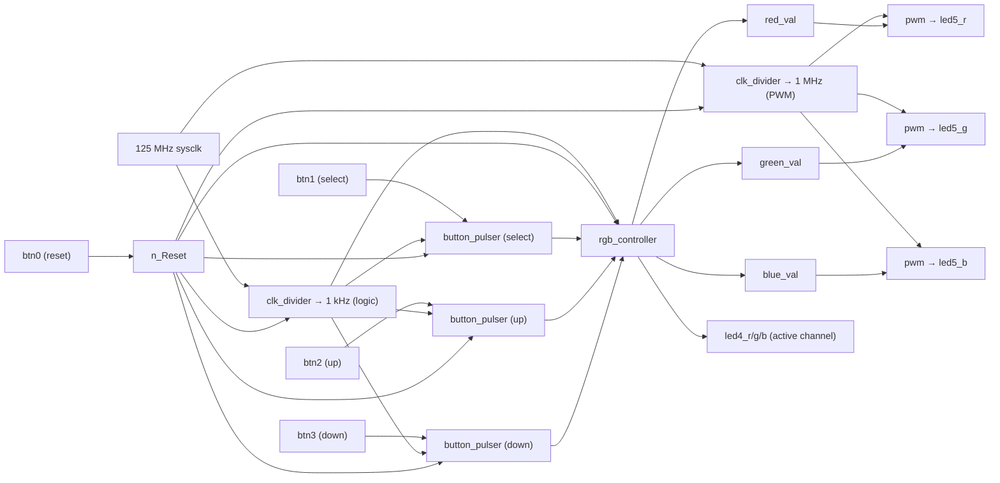

# Lab 5 – RGB Dimmer with PWM (PYNQ-Z2)

## Goal

Build an RGB dimmer using PWM.  
Practice hierarchical design, generics, FSM, multi-clock design, and module integration.

## How It Works

- A **1 kHz** clock (via `clk_divider`) drives:
  - `button_pulser`
  - `rgb_controller`
- A **1 MHz** clock (via `clk_divider`) drives:
  - all three `pwm` modules  
    (smooth dimming with lower power consumption than using raw 125 MHz)
- `button_pulser` converts button presses into clean pulses:
  - short press → single pulse
  - long press → repeated pulses
- `rgb_controller` stores three 8-bit registers (R/G/B), selects active channel, and adjusts brightness.
- Each `pwm` module generates a duty-cycle signal that drives LED5.

## Signal Flow

## Controls

- **btn0** – reset
- **btn1** – select channel (R → G → B → …)
- **btn2** – brightness up (auto-repeat)
- **btn3** – brightness down (auto-repeat)

## Components

- **Clock Divider (slow)** – 125 MHz → 1 kHz
- **Clock Divider (fast)** – 125 MHz → 1 MHz
- **Button Pulser** – clean pulses for short/long press
- **RGB Controller** – FSM + three 8-bit registers
- **PWM** – duty-cycle brightness control

## Simulation Summary

- `clk_divider` generates correct slow/fast clocks
- `button_pulser`:
  - short press → one pulse
  - long press → repeated pulses
- `rgb_controller` updates only the active channel
- `pwm` outputs match the RGB brightness values
- Top-level integrates all modules

## Notes

- 8-bit PWM → **256 brightness steps**
- RGB combination → **256³ ≈ 16.7 million colors**
- LED5 displays the mixed color from three PWMs
- LED4 indicates the currently selected channel
- Using 1 MHz instead of 125 MHz for PWM reduces power usage
